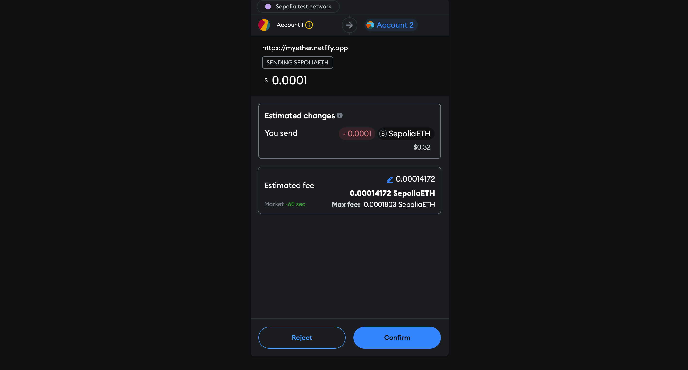

#  


## Overview

The Ether Web App is a decentralized application (dApp) that enables users to transfer Ethereum using a user-friendly web interface. This project leverages JavaScript, Solidity, and React to create a seamless experience for transferring Ethereum on the Sepolia test network. It utilizes MetaMask for wallet creation and transaction management.

## Table of Contents

- [Features](#features)
- [Technologies Used](#technologies-used)
- [Project Structure](#project-structure)
- [Installation](#installation)
- [Usage](#usage)
- [Screenshots](#screenshots)
- [Contact](#contact)

## Features

- Transfer Ethereum securely using the Sepolia test network
- MetaMask integration for wallet creation and management
- Smart contract deployment and interaction
- Responsive and intuitive UI design
- Real-time transaction status updates

## Technologies Used

- **Frontend:**
  - React
  - Tailwind CSS
  - Vite
- **Backend:**
  - Solidity
  - Hardhat
- **Wallet Integration:**
  - MetaMask

## Project Structure

```plaintext
ether/
│
├── client/
│   ├── images/
│   │   └── ether_transfer.png
│   ├── src/
│   ├── .eslintrc.js
│   ├── .gitignore
│   ├── .prettierrc
│   ├── README.md
│   ├── index.html
│   ├── package-lock.json
│   ├── package.json
│   ├── postcss.config.js
│   ├── tailwind.config.js
│   ├── vite.config.js
│   └── yarn.lock
│
├── smart_contract/
│   ├── contracts/
│   ├── ignition/
│   │   └── modules/
│   ├── scripts/
│   ├── test/
│   ├── .gitignore
│   ├── README.md
│   ├── hardhat.config.js
│   ├── package-lock.json
│   ├── package.json
```
## Installation

### Prerequisites

- Yarn or npm
- MetaMask extension installed in your browser

### Steps

1. **Clone the repository:**

    ```sh
    git clone https://github.com/ronaksharma77/ether.git
    cd ether
    ```

2. **Install dependencies for the client:**

    ```sh
    cd client
    yarn install
    # or
    npm install
    ```

3. **Install dependencies for the smart contract:**

    ```sh
    cd ../smart_contract
    yarn install
    # or
    npm install
    ```

## Usage

### Running the Client

1. **Start the development server:**

    ```sh
    cd client
    yarn dev
    # or
    npm run dev
    ```

2. Open your browser and navigate to `http://localhost:3000`

### Deploying the Smart Contract

1. **Compile the smart contract:**

    ```sh
    cd smart_contract
    npx hardhat compile
    ```

2. **Deploy the smart contract to the Sepolia test network:**

    ```sh
    npx hardhat run scripts/deploy.js --network sepolia
    ```

### Interacting with the DApp

- Ensure your MetaMask wallet is connected to the Sepolia test network.
- Use the web interface to initiate and confirm Ethereum transfers.

## Screenshots


*Home Page*


*Transfer Page*


*Transactions Page*

## Contact

- **GitHub:** [ronaksharma77](https://github.com/ronaksharma77)
- **Email:** ronaksharma.rk77@gmail.com
